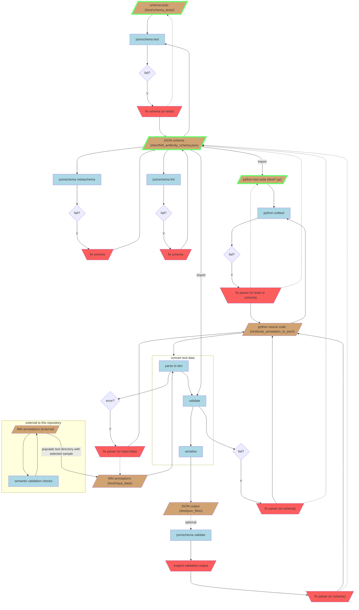

# How this project is tested

## Overview

There are a few different sources of 'ground truth' that complement each other and effectively cross-validate each 
other.

First, the desired output data structure and constraints are defined in a 
[JSON schema document](../doc/INN_antibody_schema.json).

The JSON schema validates the antibody annotation parser's output within the source code using the Python package 
[jsonschema](https://pypi.org/project/jsonschema/), and the JSON schema is itself independently tested against a 
[suite](./schema_tests) of manually written valid and invalid examples. In addition, the JSON schema is linted and this 
includes checking whether the inline schema examples are valid against the associated subschemas.

The antibody annotation parser code is unit tested with Python's unittest framework from the standard library.
This checks for semantically valid output based on the test inputs (which goes beyond schema validation of the 
output in isolation).

Currently there is also 
[one complete manually written expected output file](../test/expected_json_files/12023_expected.json) from one of the 
more complicated examples of real input data. This file is used both within the Python unit test suite (although it's 
closer to a full 'integration test') and as a [test case](./schema_tests/full_schema.json) within the schema tests.

Outside this project, the INN annotation files (input data) have undergone checks (including semantic validation) with 
other scripts.

Below is a flowchart showing a detailed overview of the whole testing process.
All file paths start at the project root.
The three main sources of ground truth (JSON schema, schema tests, and python unit tests) are highlighted with a green 
border. Manual fixes of these documents (or the python source code, or the test input data) in response to automated 
test failures are represented by red trapezoid nodes.
Upon changes to any of the manually produced (or imported) documents, any immediately connected testing processes (blue 
rectangles) are automatically run by pre-commit and/or GitHub Actions. These processes can also be run manually.



## Phases of development and types of changes

During the initial development phase (refer to the [Contributing page](../CONTRIBUTING.md#workflow)), a first draft of 
the JSON schema will have been written alongside the schema tests. The three automated testing processes for the schema 
are executed as pre-commit hooks (unless disabled) whenever the schema or schema test files are updated. Once the schema 
passes all tests, work on the python source code for the parser begins.

During the test-driven development of the parser, the python unit tests and the execution of the parser (including 
validation with the JSON schema) are expected to fail, and so the relevant 
[pre-commit hooks](../.pre-commit-config.yaml) should be temporarily disabled (e.g. by commenting them out or moving 
them to the [optional hooks](../.pre-commit-optional.yaml)). The tests should still be run manually to inform the 
development process as and when required.

(See also: [this section in the Contributing page](../CONTRIBUTING.md#maintaining-and-updating))
Once the parser has reached a fully functional form and is passing all tests, the pre-commit hooks can be re-enabled. 
Then, any subsequent changes to the parser will take one of two forms:

- Changes that affect purely tests or implementation details, so the existing test/validation processes are expected to 
pass (i.e. they are regression tests). For instance:
    - new schema tests to cover more edge cases that the existing JSON schema is expected to correctly identify,
    - similarly, new Python unit tests to cover more edge cases for the existing form of the parser,
    - new input test data (test/input_data) that doesn't contain any new keywords or value formats, and so the parser 
    is expected to convert them without any errors or schema validation failures,
    - JSON schema restructuring or reformatting that doesn't intend to affect its validation behaviour,
    - changes to the implementation of the parser source code that don't intend to affect the end result of any data 
    conversion (but which may need be accompanied by matching changes in the unit tests, in case any function/method 
    names are altered).
    
- Changes that intend to enable parsing of new annotation fields or modify the parsing behaviour for existing fields. 
These changes are expected to break the existing tests, so developers will have to change all documentation, code and 
tests in parallel, until the tests pass again. For more substantial changes, it may be best to recapitulate the 
initial test-driven development workflow, starting with the mapping documentation, then the schema and tests, and 
finally the parser's source code.


## Guidance on editing/adding and running tests

Consult the above flowcharts for manually running the relevant processes after making changes to the code, schema or 
tests. If the Python code or JSON schema fails any tests, it's more likely that the behaviour of the code/schema is at 
fault, but keep in mind the possibility of a mistake in the tests. Similarly, if there is a validation error/warning 
upon running the parser (e.g. using `pre-commit run convert-test-input --config ./.pre-commit-optional.yaml`), it's more
likely that the less transparent behaviour of the parser is at fault, but it could be the schema that needs fixing. 
If all Python unit tests pass but schema validation fails, or vice versa, there are two possibilities: (1) the schema 
and unit tests are incompatible and one of the two needs to be fixed (you decide) or (2) one of the two is less 
comprehensive and currently does not cover an edge case or a newly added annotation property.

For users or contributors who wish to experiment with modifications to the schema, schema tests or python unit tests, 
the cleanest approach is to create a new branch in git. For more experimental modifications that are expected to fail 
(at least initially), disable any [pre-commit hooks](../.pre-commit-config.yaml) that get in the way of a smooth and 
frequent enough edit and commit cycle. The hook definitions can be moved to the 
[optional config](../.pre-commit-optional.yaml), where they can still be run manually with 
`pre-commit run [hook_id] --config ./.pre-commit-optional.yaml`.
Alternatively, use the `--no-verify` option with `git commit` to skip all pre-commit tests for a 
single commit. Then, manually run the desired tests e.g. `jsonschema test path/to/test.json` or 
`python -m unittest test_module.TestCase`.

For testing the parser locally with new or modified input data, use the [/input_data/](../input_data/) and 
[/json_files/](../json_files/) directories as these are ignored by git, while the equivalent subdirectories within the 
test directory are reserved for the automated testing.

Note that the parser will be configured by default to raise a warning for validation failures, and it will continue 
execution for the remainder of the input files. The invalid JSON output will be written to a separate subdirectory 
(failed_schema_validation/) within the json_files/ output directory. This is useful for inspecting all of the output 
that fails validation. If stricter validation behaviour is desired, the parser will allow a command-line option to raise
an error and stop execution upon the first validation failure.

### JSON schema unit testing strategy

The rationale for testing the schema: schemas are code and can generate unexpected behaviour. As such, they should be 
tested against a range of valid and invalid data. Recognising that it is practically impossible (and impractical to try) 
to reach anything approaching full coverage of the space of possibilities for moderately complex multifactorial data, 
we can proceed by prioritising the invalid edge cases. These will define the minimum 'negative space' of the data, but 
without matching valid examples (the other side of each edge case, which would double the number of tests to write and 
run), we cannot be sure that the schema is more constraining than we would like. The minimum constraining behaviour of 
the schema is more important than the 'allowing' behaviour because if the schema is accidentally too strict (and this 
is not tested with valid edge cases), then in the worst case a schema validation error will occur when parsing some 
data that we expect to be valid, whereas silently letting through invalid data (due to the schema being too relaxed) 
might not got noticed until further downstream when an end user is confused by it, if it is noticed at all.

Each file in the [schema test suite](./schema_tests/) contains at least one valid example followed by several invalid 
examples that modify only one aspect of the valid example. The unit tests for array properties (which is most of them) 
follow a broadly similar pattern:
- at least one valid example
- violations at the first inner level of the property:
    - empty array
    - non-unique array
    - a single object that should be an array item
    - an additional sub-property that is not defined in the subschema (unevaluatedProperties is set to false in all 
    subschemas)
- for each array item sub-property:
    - missing from the item (only if required)
    - violations of each constraint for each sub-property separately
In addition, there is a [full schema test case](./schema_tests/full_schema.json) that imports a 
['golden example'](./expected_json_files/12023_expected.json) of what the converted JSON output should look like for the 
annotation file for the therapeutic antibody with "Request" code 12023. The valid example is modified to produce several 
invalid examples, each of which tests missing required properties or disallowed additional properties.

### Exploring the existing JSON schema or modifications/additions via manual testing

A [dev install](../README.md#installation) will install the Sourcemeta jsonschema tool and make the `jsonschema` command
available from the command line. 
The [`test` subcommand](https://github.com/sourcemeta/jsonschema/blob/main/docs/test.markdown) can be used as follows:
`jsonschema test path/to/tests/` or `jsonschema test path/to/test.json`, where the test file(s) may contain 
newly-written tests that point to the existing (unmodified) schema, or they may run existing test(s) on a modified 
schema.

### Fixing JSON schema test "target" URIs

Some of our `patternProperties` names contain characters (e.g. `^`, `|`, `[`, `]`) that are not valid if unescaped 
(percent-encoded) in a URI fragment. To avoid `jsonschema test` errors like "The input is not a valid URI", we provide 
a [helper script](../antibody_annotation_to_json/dev/fix_schema_targets.py) that re-writes the test files with valid 
"target" URI strings. This script is called in a [pre-commit hook entry](../.pre-commit-config.yaml), which blocks a
commit and automatically fixes test files with invalid URIs.
For contributors who want to write the correctly-encoded URI string themselves (either because they aren't using
pre-commit or don't want the hassle of re-staging the blocked commit), the relevant function can be imported from within
a Python session as follows:
```python
from antibody_annotation_to_json.dev.uri import fix_uri

# an example
unsafe = "../../../doc/INN_antibody_schema.jsonschema.json#/patternProperties/^(Heavy|Light)?Chain$"
safe = fix_uri(unsafe)
print(safe)
# -> ../../../doc/INN_antibody_schema.jsonschema.json#/patternProperties/%5E(Heavy%7CLight)?Chain$
```


## Optional validation with Sourcemeta's `jsonschema validate`

Note the optional validation step at the bottom of the flowchart - this refers to the `jsonschema validate` command from 
the [Sourcemeta command-line tool](https://github.com/sourcemeta/jsonschema). The output from this tool may help in 
investigating validation errors that are confusing based on the error messages from the Python jsonschema library, which 
is automatically called in the validation step of our tool. Another reason for using the Sourcemeta tool is for the 
convenience of being able to run it on the test data output rather than having to re-run the parser, if the latest 
error messages from the parser have been lost.

To run Sourcemeta's validation tool, use (from the project root):
```sh
jsonschema validate ./doc/INN_antibody_schema.json ./test/json_files/ --trace
```
The same command is also available as a pre-commit hook (which can be run from any directory within the project):
```sh
pre-commit run validate-json-files
```
If the output is too verbose, the `--trace` option can be removed
